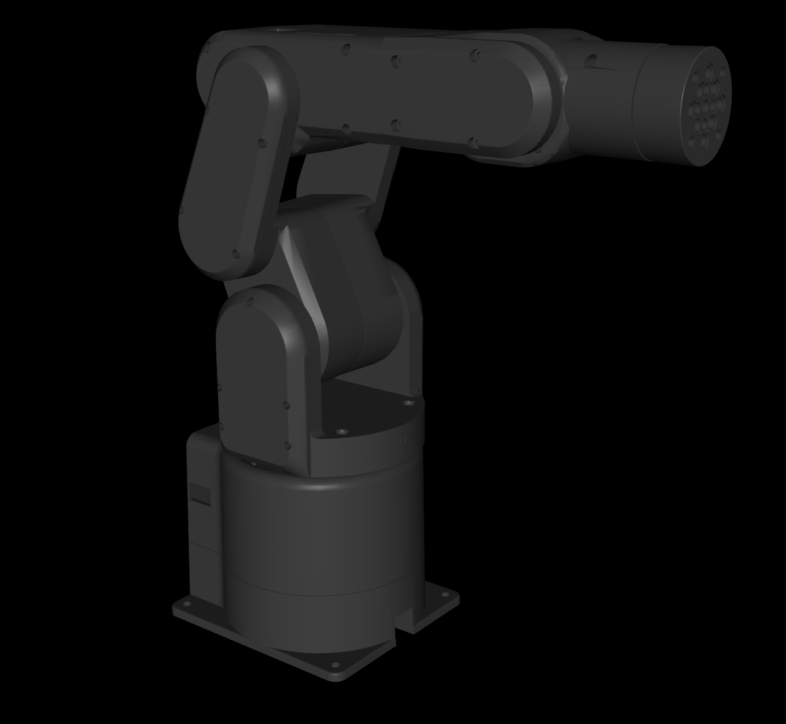

# mecharm_mujoco
MuJoCo model for MechArm Pi 270
mecharm_pi.xml |
:---------------:|
|

# Acknowledgements
Meshes and description are from:
- [https://github.com/frankaemika/franka_ros](https://github.com/elephantrobotics/mycobot_ros/tree/noetic/mycobot_description/urdf/mecharm_pi)
